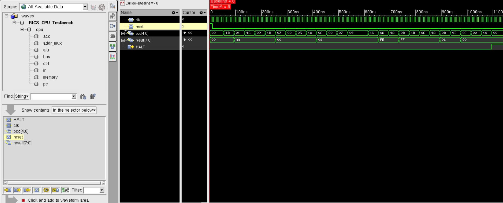
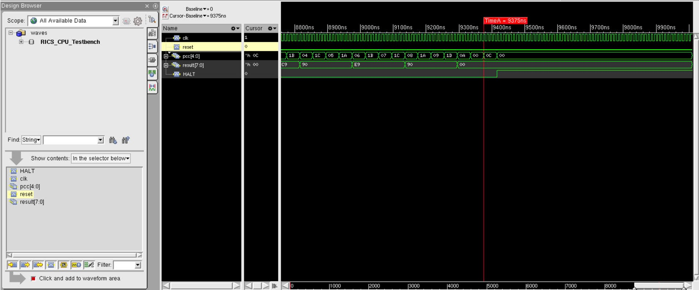
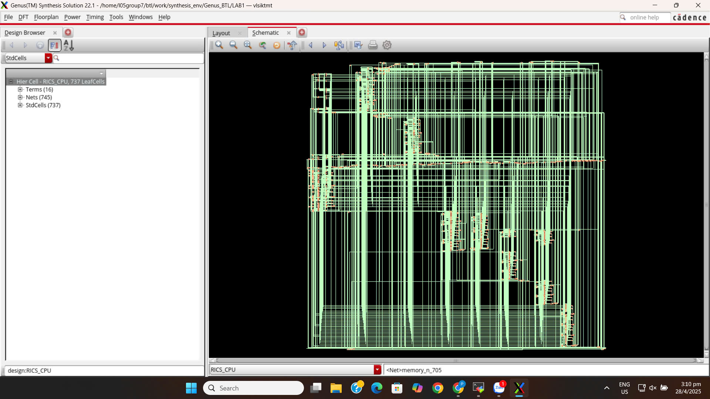
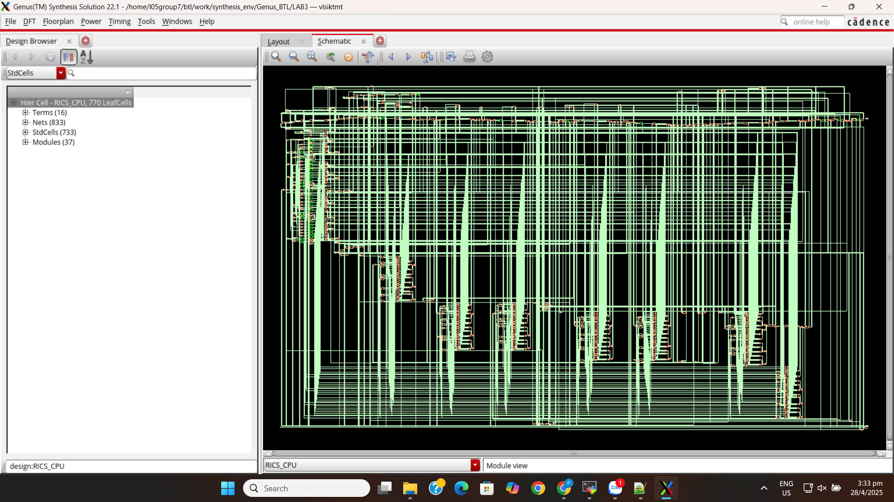
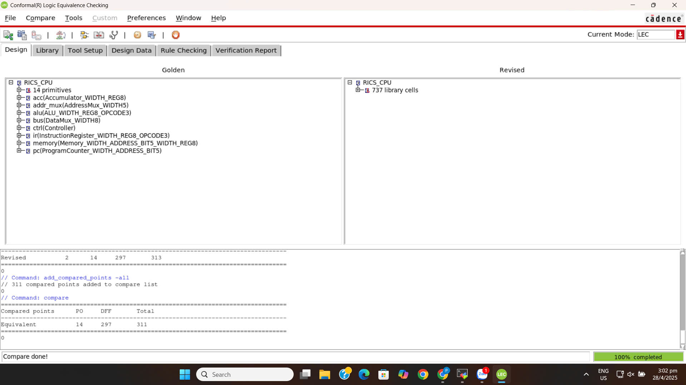

# Simple RISC CPU Design

## Introduction
RISC (Reduced Instruction Set Computer) is a modern processor design approach. In this project, we design a simple RISC CPU with a **3-bit opcode** and **5-bit operand**, allowing for **8 instruction types** and **32 address spaces**. The processor operates based on clock and reset signals and halts execution upon receiving the HALT signal.

## Requirements
Utilize knowledge from **HDL logic design** and related subjects to design a simple RISC CPU on an **FPGA development kit** such as the **Arty-Z7** or an equivalent board.

### **System Components**
- **Program Counter**: Stores the program address register.
- **Address Mux**: Selects between program and instruction addresses.
- **Memory**: Stores and provides program data.
- **Accumulator Register**: Handles data from the ALU.
- **ALU (Arithmetic Logic Unit)**: Processes data from Memory, Accumulator, and Instruction opcode.

### **System Functionality**
1. Fetch instructions from Memory.
2. Decode instructions.
3. Retrieve operands from Memory (if required).
4. Execute the instruction and perform necessary operations.
5. Store results back into Memory or Accumulator.
6. Repeat until a termination instruction is encountered.

## Detailed Design
### **Program Counter**
- Essential for counting program instructions and states.
- Operates on the rising edge of the clock.
- Reset signal is active-high and resets the counter to `0`.
- Counter width: **5 bits**.
- Supports loading a specific value; otherwise, increments normally.

### **Address Mux**
- Selects between the instruction fetch address and operand address.
- Default width: **5 bits**.
- Width should be parameterized for flexibility.

### **ALU (Arithmetic Logic Unit)**
- Executes arithmetic and logical operations based on the **3-bit opcode**.
- Supports **8-bit operands** (`inA` and `inB`), producing an **8-bit output** and a **1-bit zero flag (`is_zero`)**.
- `is_zero` flag indicates whether `inA` is zero asynchronously.
- Operations based on opcode:

| Opcode | Code | Operation |
|--------|------|------------|
| HLT | 000 | Halt program execution |
| SKZ | 001 | Skip next instruction if ALU result is 0 |
| ADD | 010 | Add Accumulator value and Memory operand, store in Accumulator |
| AND | 011 | Bitwise AND between Accumulator and Memory operand, store in Accumulator |
| XOR | 100 | Bitwise XOR between Accumulator and Memory operand, store in Accumulator |
| LDA | 101 | Load value from Memory into Accumulator |
| STO | 110 | Store Accumulator value into Memory |
| JMP | 111 | Unconditional jump to target address |

### **Controller**
- Manages CPU control signals, including instruction fetch and execution.
- Operates on the rising edge of the clock.
- Reset signal is **synchronous and active-high**.
- 3-bit opcode directly corresponds to ALU operations.
- Must support at least **8 operational states**.

### **Registers**
- **8-bit input signal**.
- **Synchronous active-high reset**.
- Operates on the rising edge of the clock.
- When load signal is active, the input value is transferred to the output.
- Otherwise, the output value remains unchanged.

### **Memory**
- Stores **both instructions and data**.
- Implements **separate read/write functionality** using a **single bidirectional data port** (no simultaneous read/write).
- **5-bit address and 8-bit data width**.
- **1-bit read/write enable signal**.
- Operates on the rising edge of the clock.

## Simple Run on Termial

### Build & Run using iverilog 
1. Preparation:
   ```sh
   sudo apt install iverilog gtkwave
   git clone https://github.com/phat-tech123/RISC-CPU.git
   ```
2. Compile the design:
   ```sh
   make compile 
   make run
   ```
3. Waveform simulations:
   ```sh
   make wave 
   ```
## Cadence tool
### Simulation using Cadence Xcelium
#### PROGRAM 1:
```sh
//opcode_operand  // addr                   assembly code
//--------------  // ----  -----------------------------------------------
    111_11110     //  00   BEGIN:   JMP TST_JMP
    000_00000     //  01            HLT        //JMP did not work at all
    000_00000     //  02            HLT        //JMP did not load PC, it skipped
    101_11010     //  03   JMP_OK:  LDA DATA_1
    001_00000     //  04            SKZ
    000_00000     //  05            HLT        //SKZ or LDA did not work
    101_11011     //  06            LDA DATA_2
    001_00000     //  07            SKZ
    111_01010     //  08            JMP SKZ_OK
    000_00000     //  09            HLT        //SKZ or LDA did not work
    110_11100     //  0A   SKZ_OK:  STO TEMP   //store non-zero value in TEMP
    101_11010     //  0B            LDA DATA_1
    110_11100     //  0C            STO TEMP   //store zero value in TEMP
    101_11100     //  0D            LDA TEMP
    001_00000     //  0E            SKZ        //check to see if STO worked
    000_00000     //  0F            HLT        //STO did not work
    100_11011     //  10            XOR DATA_2
    001_00000     //  11            SKZ        //check to see if XOR worked
    111_10100     //  12            JMP XOR_OK
    000_00000     //  13            HLT        //XOR did not work at all
    100_11011     //  14   XOR_OK:  XOR DATA_2
    001_00000     //  15            SKZ
    000_00000     //  16            HLT        //XOR did not switch all bits
    000_00000     //  17   END:     HLT        //CONGRATULATIONS - TEST1 PASSED!
    111_00000     //  18            JMP BEGIN  //run test again

    00000000      //  1A   DATA_1:             //constant 00(hex)
    11111111      //  1B   DATA_2:             //constant FF(hex)
    10101010      //  1C   TEMP:               //variable - starts with AA(hex)

    111_00011     //  1E   TST_JMP: JMP JMP_OK
    000_00000     //  1F            HLT        //JMP is broken
```


#### PROGRAM 2:
```sh
//opcode_operand  // addr                   assembly code
//--------------  // ----  -----------------------------------------------
    101_11011     //  00   BEGIN:  LDA DATA_2
    011_11100     //  01           AND DATA_3 
    100_11011     //  02           XOR DATA_2
    001_00000     //  03           SKZ
    000_00000     //  04           HLT         //AND doesn't work
    010_11010     //  05           ADD DATA_1
    001_00000     //  06           SKZ
    111_01001     //  07           JMP ADD_OK
    000_00000     //  08           HLT         //ADD doesn't work
    100_11100     //  09           XOR DATA_3
    010_11010     //  0A           ADD DATA_1  //FF plus 1 makes -1
    110_11101     //  0B           STO TEMP
    101_11010     //  0C           LDA DATA_1
    010_11101     //  0D           ADD TEMP    //-1 plus 1 should make zero
    001_00000     //  0E           SKZ
    000_00000     //  0F           HLT         //ADD Doesn't work
    000_00000     //  10   END:    HLT         //CONGRATULATIONS - TEST2 PASSED!
    111_00000     //  11           JMP BEGIN   //run test again

    00000001      //  1A   DATA_1:             //constant  1(hex)
    10101010      //  1B   DATA_2:             //constant AA(hex)
    11111111      //  1C   DATA_3:             //constant FF(hex)
    00000000      //  1D   TEMP:
```


#### PROGRAM 3:
```sh
//opcode_operand  // addr                     assembly code
//--------------  // ----  ----------------------------------------------------
    111_00011     //  00           JMP LOOP   //jump to the address of LOOP
    101_11011     //  03   LOOP:   LDA FN2    //load value in FN2 into accum
    110_11100     //  04           STO TEMP   //store accumulator in TEMP
    010_11010     //  05           ADD FN1    //add value in FN1 to accumulator
    110_11011     //  06           STO FN2    //store result in FN2
    101_11100     //  07           LDA TEMP   //load TEMP into the accumulator
    110_11010     //  08           STO FN1    //store accumulator in FN1
    100_11101     //  09           XOR LIMIT  //compare accumulator to LIMIT
    001_00000     //  0A           SKZ        //if accum = 0, skip to DONE
    111_00011     //  0B           JMP LOOP   //jump to address of LOOP
    000_00000     //  0C   DONE:   HLT        //end of program
    101_11111     //  0D   AGAIN:  LDA ONE
    110_11010     //  0E           STO FN1
    101_11110     //  0F           LDA ZERO
    110_11011     //  10           STO FN2
    111_00011     //  11           JMP LOOP   //jump to address of LOOP

    00000001      //  1A   FN1:               //data storage for 1st Fib. No.
    00000000      //  1B   FN2:               //data storage for 2nd Fib. No.
    00000000      //  1C   TEMP:              //temproray data storage
    10010000      //  1D   LIMIT:             //max value to calculate 144(dec)
    00000000      //  1E   ZERO:              //constant 0(decimal)
    00000001      //  1F   ONE:               //constant 1(decimal)
```


### Synthesis using Cadence Genus
#### BASIC GENUS SYNTHESIS:

#### LOW-POWER SYNTHESIS:


### LOGIC EQUIVALENCE CHECK using Conformal-LEC

